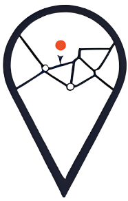
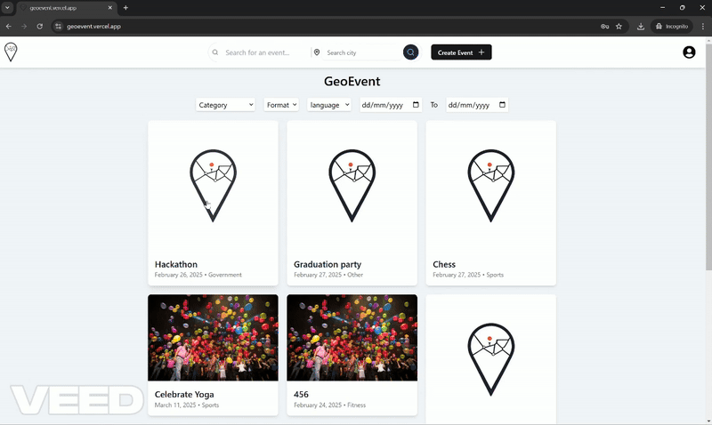

<a name="readme-top"></a>

<!-- PROJECT LOGO -->
<div align="center">
  <a href="https://github.com/soniachan1031/geoevent-project">
    
  </a>

<h3 align="center">GeoEvent</h3>

  <p align="center">
    A localized public event web application in Kitchener
    <br />
    <a href="https://github.com/soniachan1031/geoevent-project"><strong>Explore the docs »</strong></a>
    <br />
    <br />
    <a href="https://geoevent.vercel.app/">View Demo</a>
    ·
    <a href="https://github.com/soniachan1031/geoevent-project/issues">Request Feature</a>
  </p>
  </p>
</div>

<!-- TABLE OF CONTENTS -->
<details>
  <summary>Table of Contents</summary>
  <ol>
    <li>
      <a href="#about-the-project">About The Project</a>
      <ul>
        <li><a href="#built-with">Built With</a></li>
      </ul>
    </li>
    <li>
      <a href="#getting-started">Getting Started</a>
      <ul>
        <li><a href="#prerequisites">Prerequisites</a></li>
        <li><a href="#installation">Installation</a></li>
        <li><a href="#run-application-locally">Run Application</li>
      </ul>
    </li>
    <li><a href="#roadmap">Roadmap</a></li>
    <li><a href="#license">License</a></li>
  </ol>
</details>

<!--About the project-->
## geoevent-project
  <a href="https://github.com/soniachan1031/geoevent-project">
    
  </a>

## 🌍Welcome to GeoEvent – Your Ultimate Event Management Platform! 🎉
- GeoEvent is here to transform the way events are created, managed, and attended! Designed for event organizers, users, and administrators, our platform simplifies the entire event lifecycle—from planning to execution—with cutting-edge technology and an intuitive user experience.

## 📅Effortless Event Creation & Management
- Event organizers can create, edit, and manage events with ease. Set event details, define categories, and customize formats to attract the right audience.

## 🔍Seamless Event Discovery
- Users can browse, search for events, and apply filters to find the perfect match. Whether it’s a conference, workshop, or festival, discovering events has never been easier!

## 📢Smart Event Notifications
- Stay informed with real-time notifications via email alerts. Users receive updates on upcoming events, while organizers can ensure maximum engagement.

## 🔗Hassle-Free Event Sharing & Saved Events
- Share events effortlessly through social media and email. Users can bookmark events to revisit them later.

## 🌍Real-Time Navigation & Directions
- Integrated with Google Maps, GeoEvent provides precise event locations, helping users navigate effortlessly.

## ⭐Event Feedback & Ratings
- Users can submit feedback and ratings to help event organizers improve future events. Feedback moderation ensures a safe and constructive environment.

## 📊Advanced Analytics for Organizers
- Gain insights into event performance, attendance trends, and user engagement with our powerful analytics dashboard.

## 🌎Multi-Language Support
- Enjoy a seamless experience in multiple languages—customize your preferred language settings for better accessibility.

## 🔒Secure Authentication & User Management
- Securely register, log in, and manage your account with robust authentication features. Admins can moderate users and handle event approvals with ease.

GeoEvent is redefining event management with efficiency, convenience, and engagement at its core. Join us and experience the future of event planning! 🚀
<p>🔗 Check out the project on GitHub and contribute today!</p>
<p>#GeoEvent #EventManagement #SmartEvents #TechInnovation</p>

<p align="right">(<a href="#readme-top">back to top</a>)</p>

### Built With
* [![React][React]][React-url]
* [![Next][Next.js]][Next-url]
* [![NodeJS][Node.js]][Node-url]
* [![TailwindCSS][TailwindCSS]][TailwindCSS-url]
* [![MongoDB][MongoDB]][MongoDB-url]
* [![Vercel][Vercel]][Vercel-url]

<p align="right">(<a href="#readme-top">back to top</a>)</p>


<!-- GETTING STARTED -->
## Getting Started
You may follow the following instructions to setup your project locally. 

### Prerequisites
Before running the code, ensure that you have install the following software.
* node
    * https://nodejs.org/en
* npm
  ```sh
  npm install npm@latest -g
  ```

### Installation
1. Git clone the repo
    ```sh
    git clone https://github.com/soniachan1031/geoevent-project
    ```
2. Install NPM packages
    ```sh
    npm install
    ```

### Run Application Locally
1. Run the Application
    ```sh
    npm run dev
    ```
2. Open [http://localhost:3000](http://localhost:3000) with your browser

<p align="right">(<a href="#readme-top">back to top</a>)</p>

<!--Roadmap-->
## Roadmap
- [x] User Authentication & Security
- [x] Event Management System
- [x] Event Discovery & Interaction (Partially Completed)
- [x] User Notifications & Alerts (Partially Completed)
- [x] Event Sharing & Social Integration (Planned for Next Iteration)
- [x] Location & Navigation Features (Planned for Next Iteration)
- [x] User Engagement & Feedback (Planned for Next Iteration)
- [x] Multi-Language Support (Planned for Next Iteration)
- [x] Organizer & Admin Tools (Planned for Next Iteration)
- [x] Planned Features  (Planned for Next Iteration)
- [x] AI-Powered Event Recommendations (Planned for Next Iteration)
### 🚧 Planned Features (Future Iterations)
- [ ] Mobile App Version 
- [ ] Secure Payment & Ticketing System
- [ ] Chatbot for User Assistance

See the [open issues](https://github.com/soniachan1031/geoevent-project/issues) for a proposed features of enhancement 

<p align="right">(<a href="#readme-top">back to top</a>)</p>


<!--License-->
## License
Distributed under the MIT License. See `LICENSE.txt` for more information.

<p align="right">(<a href="#readme-top">back to top</a>)</p>


<!-- MARKDOWN LINKS & IMAGES -->
<!-- https://www.markdownguide.org/basic-syntax/#reference-style-links -->
[React]:https://img.shields.io/badge/React-%2320232a.svg?logo=react&logoColor=%2361DAFB
[React-url]: https://react.dev/
[Next.js]: https://img.shields.io/badge/Next.js-black?logo=next.js&logoColor=white
[Next-url]: https://nextjs.org/
[Node.js]:  https://img.shields.io/badge/Node.js-6DA55F?logo=node.js&logoColor=white
[Node-url]: https://nodejs.org/en
[TailwindCSS]: https://img.shields.io/badge/Tailwind%20CSS-%2338B2AC.svg?logo=tailwind-css&logoColor=white
[TailwindCSS-url]: https://tailwindcss.com/
[MongoDB]: https://img.shields.io/badge/MongoDB-%234ea94b.svg?logo=mongodb&logoColor=white
[MongoDB-url]: https://www.mongodb.com/
[Vercel]: https://img.shields.io/badge/Vercel-%23000000.svg?logo=vercel&logoColor=white
[Vercel-url]: https://vercel.com/
